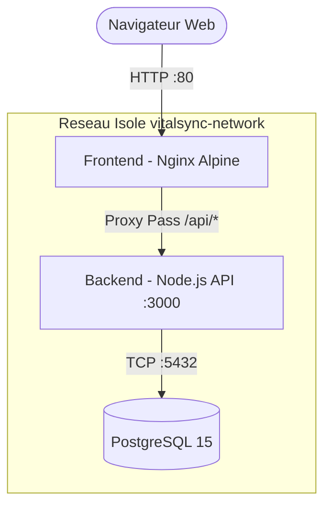

# VitalSync - Suivi Médical et Sportif

VitalSync est une application de suivi médical et sportif composée d'une interface web, d'une API backend et d'une base de données relationnelle. Ce projet met en œuvre les bonnes pratiques DevOps, incluant la conteneurisation, l'orchestration locale et une chaîne d'intégration et de déploiement continus (CI/CD).

## Architecture du Projet

L'application suit une architecture classique en trois tiers (Three-Tier) :

1. **Frontend** : Servi par un serveur Web Web statique (Nginx).
2. **Backend** : API REST développée en Node.js avec Express.
3. **Base de données** : Stockage persistant avec PostgreSQL.

### Schéma d'Architecture (Mermaid)



## Prérequis

Pour faire tourner le projet en local, assurez-vous d'avoir installé les outils suivants sur votre machine :

- [Docker](https://docs.docker.com/get-docker/) (v24+)
- Docker Compose (intégré à Docker Desktop, plugin v2)
- [Git](https://git-scm.com/)

## Lancement en local (Docker Compose)

1. Clonez le dépôt et naviguez dans le dossier racine :
   ```bash
   git clone <votre-url-repo>
   cd vitalsync
   ```
2. Préparez ou copiez le fichier d'environnement :
   ```bash
   cp .env.example .env
   ```
3. Lancez l'application en arrière-plan et déclenchez le build de vos images :
   ```bash
   docker compose up -d --build
   ```
4. Accédez au frontend via : `http://localhost`.
   _(L'API backend est accessible virtuellement via Nginx sur `http://localhost/api/activities`)_.

Pour arrêter et supprimer proprement les conteneurs :

```bash
docker compose down
```

## Chaîne d'Intégration et de Déploiement Continus (CI/CD)

La pipeline est configurée avec **GitHub Actions** (`.github/workflows/ci-cd.yml`) et se déclenche automatiquement lors d'un `push` sur la branche `develop` ou lors d'une `Pull Request` vers la branche `main`.

Elle se divise en 3 grandes étapes automatisées :

1. **Lint & Tests** : Installation des dépendances, vérification qualitative de la syntaxe par ESLint (Flat Config v9) et exécution des tests unitaires avec Jest. Si ces contrôles échouent, le workflow s'interrompt pour ne pas propager de bugs.
2. **Build Docker & Push** : En cas de succès des tests, les images Docker pour le frontend et le backend sont construites (via multi-stage builds). Elles sont tagguées avec le SHA unique du commit pour une parfaite traçabilité, puis poussées et hébergées sur le **GHCR (GitHub Container Registry)**.
3. **Déploiement Staging & Health Check** : Déploiement éphémère de l'infrastructure via Docker Compose directement sur le runner GitHub, suivi d'un ping `curl` (qui s'attend à recevoir le Code HTTP 200) sur l'endpoint `/health` du backend. Si ce test réseau échoue, on force un `exit 1` avec interruption et notification d'erreur.

## Choix Techniques et Justifications

- **Images Alpine Linux (`node:20-alpine`, `nginx:alpine`)** : Choisies délibérément pour réduire drastiquement la taille des images Docker (baissant les coûts et le temps de build) et pour minimiser la surface d'attaque en cas de faille de sécurité (CVEs).
- **Multi-stage Build (Backend)** : Sépare l'environnement de build/test (très lourd) de l'environnement de production (très léger). Les dépendances de développement (`jest`, `eslint`) et les logs ne finissent volontairement jamais dans l'image finale déployable, allégeant et sécurisant le tout.
- **Nginx & Proxy Pass** : Utilisation de Nginx pour servir le frontend _et_ pour agir comme Reverse Proxy vers le backend sur `localhost/api/`. Cela contourne gracieusement les problèmes de CORS et sécurise le backend en bloquant son exposition directe sur le net (on ne traverse que le port 80/443 public).
- **GitHub Actions & GHCR** : L'écosystème parfait, naturellement intégré au dépôt Git source. GHCR gère de façon fluide les permissions `read/write` directement via le `GITHUB_TOKEN` généré pour les workflows, sans imposer la lourde gestion de secrets ou mots de passe distants à renouveler (comme sur Docker Hub).
- **Réseau Bridge Docker (`vitalsync-network`)** : Isolation des 3 conteneurs dans un sous-réseau virtuel privé empêchant leur altération extérieure, tout en fournissant une résolution DNS magique intégrée par Docker (le Nginx discute simplement à `http://backend:3000` par nom d'hôte).
